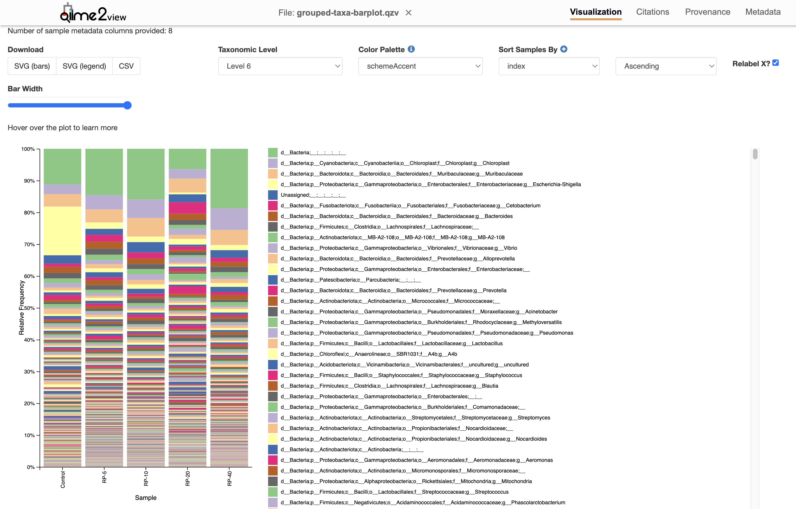

# 3. Training a full-length 16S rRNA classifier for taxonomic classification using the Naïve Bayes method in QIIME 2
For taxonomic classifications, you need to have a classifier to which you blast your sequences against to find out which taxonomic groups each sequence belongs to. This is also called reference phylogeny, which is a cruitial step in identifying the marker genes (in this case 16S rRNA) taken from different environmental a in saco samples. In order to do so, there are different 16S rRNA databases, of which Greengens and SILVA are well-known databases for the full length of 16S rRNA genes. You can always download the pre-trained classifiers at the Data Resources of qiime2 website with the follwoing command:
```bash
wget https://data.qiime2.org/2023.7/common/silva-138-99-seqs.qza -O silva_data/silva-138-99-seqs.qza
wget https://data.qiime2.org/2023.7/common/silva-138-99-tax.qza -O silva_data/silva-138-99-tax.qza
```
**Train the downloaded database**
```bash
qiime feature-classifier fit-classifier-naive-bayes \
  --i-reference-reads silva_data/silva-138-99-seqs.qza \
  --i-reference-taxonomy silva_data/silva-138-99-tax.qza \
  --o-classifier silva_data/silva-classifier.qza
```
After you got **silva-classifier.qza** classifier file, you can use it for your taxonomic classifications as follows:
## Taxonomic classification with a confidence score threshold of 90%
```bash
qiime feature-classifier classify-sklearn \
  --i-classifier silva_data/silva-138-99-nb-classifier.qza \
  --i-reads rep-seqs-no-chimera.qza \
  --p-confidence 0.8 \
  --o-classification taxonomy.qza
```
**Generate taxa bar plot**
```bash
qiime taxa barplot \
  --i-table filtered-table.qza \
  --i-taxonomy taxonomy.qza \
  --m-metadata-file metadata.tsv \
  --o-visualization taxa-barplot.qzv
```

**Figure 6. Taxonomy classification bar plot at genus level**

You can see in the [taxa barplot](https://github.com/thaocaoHPzbook/Goldfish-16S-rRNA-amplicon-data-analysis/blob/main/Qiime_steps/taxa-barplot.qzv) that most samples have similar microbial compositions, except for one **control sample** and one **RP-20 sample**, which show abnormal patterns. This could be due to low sequencing depth, leading to an inaccurate representation of microbial diversity in these samples. Further analysis is needed to determine whether the microbial compositions in these samples, particularly in the control sample and RP-20 sample, differ significantly in a statistically meaningful way.

To investigate further, we will examine the summary statistics after chimera filtering and perform rarefaction curve analysis in the next steps.  

### **Grouping feature table by Treatment**
To compare microbial compositions at the treatment group level, we first aggregate the feature table by the `Treatment` column in the metadata. This step sums the feature abundances within each treatment group.

```bash
qiime feature-table group \
  --i-table Qiime_steps/filtered-table.qza \
  --m-metadata-file Qiime_steps/metadata.tsv \
  --m-metadata-column Treatment \
  --p-mode sum \
  --p-axis sample \
  --o-grouped-table Qiime_steps/grouped-feature-table.qza
```
After grouping, we generate a summary of the grouped feature table to check the total frequency and number of features per treatment group.

```bash
qiime feature-table summarize \
  --i-table Qiime_steps/grouped-feature-table.qza \
  --o-visualization Qiime_steps/grouped-feature-table.qzv
```

### **Taxonomic Classification of Grouped Data**
Once the feature table is grouped by treatment using [metadata_grouped.tsv](Qiime_steps/metadata_grouped.tsv), we can generate a taxa barplot to visualize the taxonomic composition of each treatment group.

```bash
qiime taxa barplot \
  --i-table Qiime_steps/grouped-feature-table.qza \
  --i-taxonomy Qiime_steps/taxonomy.qza \
  --m-metadata-file Qiime_steps/metadata_grouped.tsv \
  --o-visualization Qiime_steps/grouped-taxa-barplot.qzv
```

The grouped taxa barplot helps us compare microbial compositions across different treatment groups, allowing us to identify major taxonomic differences at various classification levels.

