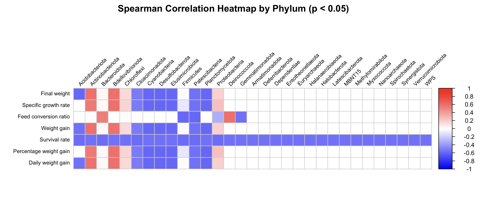
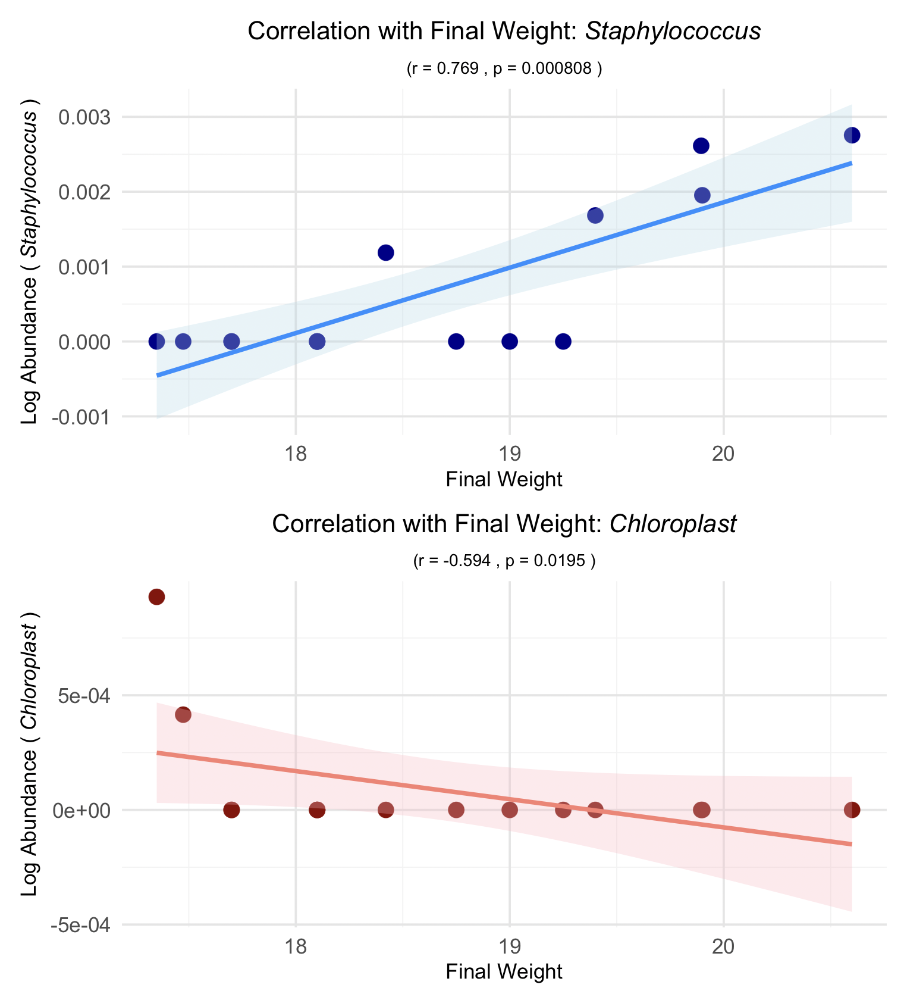

# 1. Differential abundance analysis of taxa by ANCOMBC
## 1.1 Set up working environment
```bash
if (!requireNamespace("BiocManager", quietly = TRUE))
    install.packages("BiocManager")
BiocManager::install("ANCOMBC")
```

## 1.2. Read and Prepare Data
```bash
feature_table <- read.table("feature-table.tsv", header = TRUE, row.names = 1, sep = "\t")
metadata <- read.table("metadata.tsv", header = TRUE, row.names = 1, sep = "\t")
```

## 1.3. Convert Data into Phyloseq Object
```bash
library(phyloseq)

# Create an ASV table object
otu_phyloseq <- otu_table(feature_table, taxa_are_rows = TRUE)

# Create a sample_data object from metadata
sample_metadata <- sample_data(metadata)

# Check the structure of the ASV table
str(otu_phyloseq)

# Combine ASV table and metadata into a Phyloseq object
ps <- phyloseq(otu_phyloseq, sample_metadata)
```

## 1.4. Matching Sample Names
```bash
# Check sample names in the OTU table
sample_names(otu_phyloseq)

# Check sample names in the metadata
rownames(sample_metadata)

# Rename OTU table sample names to match metadata sample names
sample_names(otu_phyloseq) <- rownames(sample_metadata)

# Removes any X prefixes that might have been introduced when importing data
sample_names(otu_phyloseq) <- gsub("^X", "", sample_names(otu_phyloseq))

# Ensure sample names are numeric (if applicable)
sample_names(otu_phyloseq) <- as.character(as.numeric(sample_names(otu_phyloseq)))

# Reorder samples in the OTU table to match metadata order
otu_phyloseq <- prune_samples(rownames(sample_metadata), otu_phyloseq)

# Transform sample counts without changing OTU values
otu_phyloseq <- transform_sample_counts(otu_phyloseq, identity)

# Reapply correct sample names
sample_names(otu_phyloseq) <- rownames(sample_metadata)

# Check sample names after processing
print(sample_names(otu_phyloseq))
print(rownames(sample_metadata))

# Create a phyloseq object combining OTU table and metadata
ps <- phyloseq(otu_phyloseq, sample_metadata)
```

## 1.5 Add a pseudo-count to the OUT table to handle zero values
```bash
# Add a pseudo-count to the ASV table to handle zero values
otu_table_with_pseudo <- otu_table(ps) + 0.5

# Create a new phyloseq object with pseudo-count added OTU table
ps_with_pseudo <- phyloseq(otu_table(otu_table_with_pseudo, taxa_are_rows = TRUE), sample_data(ps))

# Check the updated phyloseq object
ps_with_pseudo
```
## 1.6 Convert Phyloseq Object into OTU Table and Metadata
**Extract OTU table and metadata from phyloseq object**
```bash
otu_data <- otu_table(ps_with_pseudo)
sample_data <- sample_data(ps_with_pseudo)
```

##  1.7 Run ANCOM-BC2 with Pseudo-Count Adjusted Data
```bash
res_ancombc2 <- ancombc2(
  data = ps_with_pseudo,    # Phyloseq object with pseudo-counts
  fix_formula = "Treatment", # Variable for comparison
  p_adj_method = "holm",     # Multiple testing correction
  alpha = 0.05,              # Significance level
  pairwise = TRUE,           # Enable pairwise comparison
  group = "Treatment"        # Grouping variable
)
```

## 1.8 Save the ANCOM-BC2 results to a CSV file
```bash
ancombc2_results <- res_ancombc2$res
write.csv(ancombc2_results, "ancombc2_results.csv", row.names = TRUE)

# Save pairwise comparison results to a CSV file
write.csv(res_ancombc2$res_pair, "pairwise_comparisons_results.csv", row.names = TRUE)
```
[ancombc2_results.csv](https://github.com/thaocaoHPzbook/Goldfish-16S-rRNA-amplicon-data-analysis/blob/main/R_steps/ancombc2_results.csv), [pairwise_comparisons_results.csv](https://github.com/thaocaoHPzbook/Goldfish-16S-rRNA-amplicon-data-analysis/blob/main/R_steps/pairwise_comparisons_results.csv) files are created.


# 2. Analysis of biomarkers for gut microbiome
## 2.1. Filtering Taxa with Significant p-value<0.05
```bash
# Filter taxa with p-value < 0.05, q-value<0.5, diff=TRUE, and passed_ss=TRUE
library(tidyr)
library(dplyr)
filtered_ancombc2_results <- ancombc2_results %>%
  filter(
    (p_TreatmentRP.5 < 0.05 & q_TreatmentRP.5 < 0.05 & diff_TreatmentRP.5 == TRUE & passed_ss_TreatmentRP.5 == TRUE) |
    (p_TreatmentRP.10 < 0.05 & q_TreatmentRP.10 < 0.05 & diff_TreatmentRP.10 == TRUE & passed_ss_TreatmentRP.10 == TRUE) |
    (p_TreatmentRP.20 < 0.05 & q_TreatmentRP.20 < 0.05 & diff_TreatmentRP.20 == TRUE & passed_ss_TreatmentRP.20 == TRUE) |
    (p_TreatmentRP.40 < 0.05 & q_TreatmentRP.40 < 0.05 & diff_TreatmentRP.40 == TRUE & passed_ss_TreatmentRP.40 == TRUE)
  )
# Save filtered results to a CSV file
write.csv(df_filtered, "filtered_ancombc2_results.csv", row.names = TRUE)
```
    
**Merge taxomomy.tsv with filtered_ancombc2_results.csv**
```bash
library(dplyr)
library(readr)

# Read taxonomy.tsv file
taxonomy <- read_tsv("taxonomy.tsv")

# Read filtered_ancombc2_parirwise_results.csv file
filtered_results <- read_csv("filtered_ancombc2_results.csv")

# Join data
merged_results <- filtered_results %>%
  left_join(taxonomy, by = c("taxon" = "Feature ID"))

# Check the results
head(merged_results)

# Replace taxon with Taxon name
final_results <- merged_results %>%
  select(-taxon) %>%
  rename(taxon = Taxon)

# Exporting csv file
write_csv(final_results, "filtered_ancombc2_results_with_taxonomy.csv")
```
[filtered_ancombc2_results_with_taxonomy.csv](https://github.com/thaocaoHPzbook/Goldfish-16S-rRNA-amplicon-data-analysis/blob/main/R_steps/filtered_ancombc2_results_with_taxonomy.csv) is generated.

## 2.2. Visualization of Log Fold Changes of Taxa with Significant p-value<0.05
```bash
library(ggplot2)
library(stringr)
library(tidyr)
library(dplyr)
library(readr)

# Read data
filtered_ancombc2_results <- read_csv("filtered_ancombc2_results_with_taxonomy.csv")

# Extract genus level name from taxon
filtered_ancombc2_results$genus <- str_extract(filtered_ancombc2_results$taxon, "g__[^;]+")

# Convert data to long format
filtered_long <- filtered_ancombc2_results %>%
  pivot_longer(cols = starts_with("lfc_TreatmentRP"),
               names_to = "treatment",
               values_to = "lfc") %>%
  mutate(treatment = str_replace(treatment, "lfc_Treatment", "")) %>%
  pivot_longer(cols = starts_with("p_TreatmentRP"),
               names_to = "p_treatment",
               values_to = "p_value") %>%
  filter(str_replace(p_treatment, "p_Treatment", "") == treatment) %>% 
  select(-p_treatment)

# Mark * at p-value < 0.05
filtered_long$significance <- ifelse(filtered_long$p_value < 0.05, "*", "")

# Define fresh & vibrant colors
vibrant_colors <- c("RP.5" = "#FF6B6B",  # Coral Red
                    "RP.10" = "#4ECDC4", # Turquoise
                    "RP.20" = "#FFD166", # Bright Yellow
                    "RP.40" = "#06D6A0", # Mint Green
                    "RP.X" = "#A29BFE")  # Light Purple

# Plotting
p <- ggplot(filtered_long, aes(x = genus, y = lfc, fill = treatment)) +
    geom_col(position = position_dodge(width = 0.7),
             width = 0.6,
             show.legend = TRUE) +  
    geom_text(aes(label = significance, y = lfc + sign(lfc) * 0.4), 
              position = position_dodge(width = 0.7), 
              size = 6, color = "black") +
    geom_hline(yintercept = 0, linetype = "dashed", color = "gray30") + 
    scale_fill_manual(values = vibrant_colors) +
    labs(x = "Genus",
         y = "Log Fold Change",
         fill = "Treatment") +
    theme_minimal(base_size = 14) +
    theme(axis.text.x = element_text(angle = 45, hjust = 1, size = 10),
          legend.position = "right")  

# Display the plot
print(p)
```
```bash
# Save the plot as a PNG file
ggsave("lfc_by_treatment.png", plot = last_plot(), width = 8, height = 6)
```
[lfc_by_treatment.png](https://github.com/thaocaoHPzbook/Goldfish-16S-rRNA-amplicon-data-analysis/blob/main/R_steps/lfc_by_treatment2.png) is a visualization of taxa that have significant log fold change values.


In this plot, the genera with statistically significant differences between treatment groups and the control group are highlighted. Asterisks (*) indicate treatments where the genus shows a significant difference (p-value < 0.05) compared to the control.

## 2.3  Visualization of Log Fold Changes of Taxa with Significant p-value<0.05 - pairwise comparision
```bash
# Filter taxa with p-value < 0.05, q-value<0.5, diff=TRUE, and passed_ss=TRUE
filtered_ancombc2_results <- ancombc2_results %>%
  filter(
    (.data[["p_TreatmentRP-20_TreatmentRP-10"]] < 0.05 &
     .data[["q_TreatmentRP-20_TreatmentRP-10"]] < 0.05 &
     .data[["diff_TreatmentRP-20_TreatmentRP-10"]] == TRUE &
     .data[["passed_ss_TreatmentRP-20_TreatmentRP-10"]] == TRUE) |
    
    (.data[["p_TreatmentRP-40_TreatmentRP-10"]] < 0.05 &
     .data[["q_TreatmentRP-40_TreatmentRP-10"]] < 0.05 &
     .data[["diff_TreatmentRP-40_TreatmentRP-10"]] == TRUE &
     .data[["passed_ss_TreatmentRP-40_TreatmentRP-10"]] == TRUE) |
    
    (.data[["p_TreatmentRP-5_TreatmentRP-10"]] < 0.05 &
     .data[["q_TreatmentRP-5_TreatmentRP-10"]] < 0.05 &
     .data[["diff_TreatmentRP-5_TreatmentRP-10"]] == TRUE &
     .data[["passed_ss_TreatmentRP-5_TreatmentRP-10"]] == TRUE) |
    
    (.data[["p_TreatmentRP-40_TreatmentRP-20"]] < 0.05 &
     .data[["q_TreatmentRP-40_TreatmentRP-20"]] < 0.05 &
     .data[["diff_TreatmentRP-40_TreatmentRP-20"]] == TRUE &
     .data[["passed_ss_TreatmentRP-40_TreatmentRP-20"]] == TRUE) |
    
    (.data[["p_TreatmentRP-5_TreatmentRP-20"]] < 0.05 &
     .data[["q_TreatmentRP-5_TreatmentRP-20"]] < 0.05 &
     .data[["diff_TreatmentRP-5_TreatmentRP-20"]] == TRUE &
     .data[["passed_ss_TreatmentRP-5_TreatmentRP-20"]] == TRUE) |
    
    (.data[["p_TreatmentRP-5_TreatmentRP-40"]] < 0.05 &
     .data[["q_TreatmentRP-5_TreatmentRP-40"]] < 0.05 &
     .data[["diff_TreatmentRP-5_TreatmentRP-40"]] == TRUE &
     .data[["passed_ss_TreatmentRP-5_TreatmentRP-40"]] == TRUE)
  )

# Save filtered results to a CSV file
write.csv(df_filtered, "filtered_ancombc2_parirwise_results.csv", row.names = TRUE)
```
[filtered_ancombc2_parirwise_results.csv"](https://github.com/thaocaoHPzbook/Goldfish-16S-rRNA-amplicon-data-analysis/blob/main/R_steps/filtered_ancombc2_pairwise_results_with_taxonomy.csv) is generated.    
**Merge taxomomy.tsv with filtered_ancombc2_parirwise_results.csv**
```bash
library(dplyr)
library(readr)

# Read taxonomy.tsv file
taxonomy <- read_tsv("taxonomy.tsv")

# Read filtered_ancombc2_parirwise_results.csv file
filtered_results <- read_csv("filtered_ancombc2_pairwise_results.csv")

# Join data
merged_results <- filtered_results %>%
  left_join(taxonomy, by = c("taxon" = "Feature ID"))

# Check the results
head(merged_results)

# Replace taxon with Taxon name
final_results <- merged_results %>%
  select(-taxon) %>%
  rename(taxon = Taxon)

# Exporting csv file
write_csv(final_results, "filtered_ancombc2_pairwise_results_with_taxonomy.csv")
```

```bash
filtered_ancombc2_results <- read.csv("filtered_ancombc2_pairwise_results_with_taxonomy.csv", 
                                      stringsAsFactors = FALSE, 
                                      check.names = FALSE)
```

**Plotting**
```bash
library(tidyr)
library(dplyr)
library(stringr)
library(ggplot2)

# 1. List of comparison
target_cols <- c(
    "lfc_TreatmentRP-20_TreatmentRP-10",
    "lfc_TreatmentRP-40_TreatmentRP-10",
    "lfc_TreatmentRP-5_TreatmentRP-10",
    "lfc_TreatmentRP-40_TreatmentRP-20",
    "lfc_TreatmentRP-5_TreatmentRP-20",
    "lfc_TreatmentRP-5_TreatmentRP-40"
)

pval_cols <- str_replace(target_cols, "lfc_", "p_")  # Create p-value column

# 2. Filter taxon to genus level and convert to long format
long_results <- filtered_ancombc2_results %>%
    filter(!is.na(taxon)) %>%
    pivot_longer(
        cols = all_of(target_cols),
        names_to = "comparison",
        values_to = "lfc"
    ) %>%
    mutate(
        comparison = str_replace(comparison, "lfc_", ""),
        genus = str_extract(taxon, "g__[^;]+")
    ) %>%
    filter(!is.na(genus)) %>%
    inner_join(
        filtered_ancombc2_results %>%
            pivot_longer(
                cols = all_of(pval_cols),
                names_to = "comparison",
                values_to = "pvalue"
            ) %>%
            mutate(comparison = str_replace(comparison, "p_", "")),
        by = c("taxon", "comparison")
    ) %>%
    group_by(genus, comparison) %>%
    summarise(
        lfc = mean(lfc, na.rm = TRUE),
        pvalue = mean(pvalue, na.rm = TRUE)
    ) %>%
    mutate(
        significant = ifelse(pvalue < 0.05, "*", ""),
        offset = ifelse(lfc >= 0, lfc + 0.2, lfc - 0.4)
    ) %>%
    ungroup()

# 3. Plotting
p <- ggplot(long_results, aes(x = genus, y = lfc, fill = comparison)) +
    geom_col(position = position_dodge(width = 0.7), width = 0.6, color = "black") +
    geom_text(aes(label = significant, y = offset),  
              position = position_dodge(width = 0.7),  
              size = 6, fontface = "bold", color = "black") +
    geom_hline(yintercept = 0, linetype = "dashed", color = "gray30") +
    scale_fill_manual(
        values = c(
            "TreatmentRP-20_TreatmentRP-10" = "#E57373",  # Red pastel
            "TreatmentRP-40_TreatmentRP-10" = "#64B5F6",  # Blue pastel
            "TreatmentRP-5_TreatmentRP-10"  = "#81C784",  # Green pastel
            "TreatmentRP-40_TreatmentRP-20" = "#BA68C8",  # Purple paste
            "TreatmentRP-5_TreatmentRP-20"  = "#FFB74D",  # Orange pastel
            "TreatmentRP-5_TreatmentRP-40"  = "#FFF176"   # Yellow pastel
        )
    ) +
    labs(
        x = "Genus",
        y = "Log Fold Change",
        fill = "Comparison"
    ) +
    theme_minimal(base_size = 14) +
    theme(
        plot.title = element_text(hjust = 0.5, face = "bold"),
        axis.text.x = element_text(angle = 45, hjust = 1, size = 10),
        legend.position = "bottom"
    )

print(p)
```
**Save the plot**
```bash
# Save the plot as a PNG file
ggsave("lfc_by_treatment_pairwise.png", plot = last_plot(), width = 8, height = 6)
```
[lfc_by_treatment_pairwise.png](https://github.com/thaocaoHPzbook/Goldfish-16S-rRNA-amplicon-data-analysis/blob/main/R_steps/lfc_by_treatment_pairwise2.png) is generated


In this plot, the genera with statistically significant differences in pairwise comparisons between treatment groups are highlighted. Asterisks (*) indicate treatment pairs where the genus shows a significant difference (p-value < 0.05).

# 3. Spearman Correlation Analysis

This section performs Spearman correlation analysis on goldfish gut microbiome data. It calculates correlations between selected growth parameters and microbiome features, and visualizes significant relationships.

## 3.1 Prerequisites

### 3.1.1 Install Required Packages

Ensure you have the necessary R packages installed before running the script:

```r
install.packages(c("tidyverse", "Hmisc", "corrplot", "vegan", "ggplot2", "patchwork"))
```

### 3.1.2 Load Necessary Libraries

Load the required R libraries for the analysis:

```r
library(tidyverse)
library(Hmisc)
library(corrplot)
library(vegan)
library(ggplot2)
library(patchwork)
```

## 3.2 Correlation Analysis of Growth Parameters

### 3.2.1 Read Metadata

Read the metadata file containing growth parameters:

```r
metadata <- read.delim("/Users/truonganhtu/Documents/Chula_gut_microbiome/GoldFish/metadata.tsv", sep="\t")
```

### 3.2.2 Preprocess Metadata

#### 3.2.2.1 Replace Commas with Dots and Convert to Numeric

Convert character columns containing numbers (with commas) to numeric format by replacing commas with dots:

```r
metadata <- metadata %>%
  mutate(across(where(is.character), ~ gsub(",", ".", .))) %>%
  mutate(across(where(~ all(grepl("^[0-9.]+$", .))), as.numeric))
```

#### 3.2.2.2 Normalize Column Names

Trim whitespace from column names to avoid errors during selection:

```r
colnames(metadata) <- trimws(colnames(metadata))
```

#### 3.2.2.3 Select Growth Parameters

Select the relevant growth parameters for analysis:

```r
metadata_selected <- metadata %>%
  select(Final.weight, Specific.growth.rate, Feed.conversion.ratio, 
         Weight.gain, Survival.rate, Percentage.weight.gain, Daily.weight.gain)
```

### 3.2.3 Calculate Spearman Correlation

Compute the Spearman correlation matrix and corresponding p-values for growth parameters:

```r
cor_result <- rcorr(as.matrix(metadata_selected), type = "spearman")
cor_matrix <- cor_result$r  # Correlation matrix
p_matrix <- cor_result$P    # p-value matrix
```

### 3.2.4 Filter Significant Correlations

#### 3.2.4.1 Create DataFrame of Significant Correlations

Create a dataframe containing only significant correlations (p < 0.05), excluding self-correlations:

```r
cor_df <- as.data.frame(as.table(cor_matrix)) %>%
  rename(Var1 = Var1, Var2 = Var2, Correlation = Freq) %>%
  mutate(P_value = as.vector(p_matrix)) %>%
  filter(P_value < 0.05 & Var1 != Var2)  # Remove self-correlation
```

#### 3.2.4.2 Export Significant Correlations

Export the filtered significant correlations to a CSV file:

```r
write.csv(cor_df, "spearman_growth_parameters.csv", row.names = FALSE)
```

**Exported Data:**  
- [spearman_growth_parameters.csv](spearman_growth_parameters.csv)

#### 3.2.4.3 Prepare Filtered Correlation Matrix

Set non-significant values (p ≥ 0.05) to 0 in the correlation matrix and remove self-correlations:

```r
cor_matrix_filtered <- cor_matrix
cor_matrix_filtered[p_matrix >= 0.05] <- 0
diag(cor_matrix_filtered) <- 0  # Remove self-correlation
```

### 3.2.5 Visualize Correlation of Growth Parameters

Plot a correlation diagram to visualize significant correlations between growth parameters:

```r
corrplot(cor_matrix_filtered, 
         method = "circle", 
         type = "upper",  
         tl.col = "black", 
         tl.cex = 1.0,  
         tl.srt = 45,  
         tl.offset = 0.5,  
         col = colorRampPalette(c("#1F77B4", "#FFFFFF", "#FF4040"))(100),  
         addCoef.col = "black",  # Show correlation coefficients
         number.cex = 1.2,  
         number.digits = 2,  
         mar = c(0, 0, 3, 0),  
         title = "Correlations between Growth Parameters (p < 0.05)",
         cl.cex = 0.8,  
         cl.length = 5,  
         cl.ratio = 0.2,  
         addgrid.col = "gray95", 
         cl.lim = c(-1, 1),  
         cl.align.text = "l",  
         cl.ratio.text = 0.5,  
         cl.lab = "Correlation")  
```

**Visualization:**  
  
*Download:* [Correlations between Growth Parameters](R_steps/Correlations%20between%20Growth%20Parameters.png)

## 3.3 Correlation Analysis between Microbiome and Growth Parameters

### 3.3.1 Data Preparation

#### 3.3.1.1 Read Data Files

Read the feature table and taxonomy files for microbiome analysis:

```r
metadata <- read_tsv("metadata.tsv")
feature_table <- read_tsv("feature-table.tsv")
taxonomy <- read_tsv("taxonomy.tsv")
```

#### 3.3.1.2 Preprocess Feature Table

##### Rename Columns in Feature Table

Rename columns in the feature table to match sample IDs in the metadata:

```r
sample_ids <- metadata$`sample-id`
colnames(feature_table)[-1] <- sample_ids  # Exclude OTU ID column
```

##### Transpose Feature Table

Transpose the feature table to have samples as rows and OTUs as columns:

```r
feature_table_t <- feature_table %>%
  column_to_rownames(var = "OTU ID") %>%
  t() %>%
  as.data.frame()
```

#### 3.3.1.3 Normalize Data

Normalize the feature table using total normalization followed by a log1p transformation:

```r
feature_table_normalized <- decostand(feature_table_t, method = "total")
feature_table_log <- log1p(feature_table_normalized)
```

#### 3.3.1.4 Combine Metadata and Feature Table

##### Select Metadata Variables

Select the relevant metadata variables (growth parameters) and set sample IDs as row names:

```r
metadata_selected <- metadata %>%
  select(`sample-id`, `Final weight`, `Specific growth rate`, `Feed conversion ratio`, 
         `Weight gain`, `Survival rate`, `Percentage weight gain`, `Daily weight gain`) %>%
  column_to_rownames(var = "sample-id")
```

##### Merge Data

Combine the metadata and normalized feature table:

```r
combined_data <- merge(metadata_selected, feature_table_log, by = "row.names")
rownames(combined_data) <- combined_data$Row.names
combined_data <- combined_data %>% select(-Row.names)
```

### 3.3.2 Correlation Computation

#### 3.3.2.1 Separate Metadata and OTU Data

Separate the metadata variables (growth parameters) and OTU data:

```r
metadata_vars <- combined_data[, 1:7]  # Metadata variables
otu_data <- combined_data[, 8:ncol(combined_data)]  # OTUs
```

#### 3.3.2.2 Compute Correlation

Calculate the Spearman correlation between metadata variables and OTUs:

```r
cor_result <- rcorr(as.matrix(cbind(metadata_vars, otu_data)), type = "spearman")
cor_matrix <- cor_result$r
p_matrix <- cor_result$P

cor_metadata_otu <- cor_matrix[1:7, 8:ncol(cor_matrix)]
p_metadata_otu <- p_matrix[1:7, 8:ncol(p_matrix)]
```

#### 3.3.2.3 Create DataFrame of Significant Correlations

Create a dataframe of significant correlations (p < 0.05) between metadata and OTUs:

```r
cor_df <- as.data.frame(as.table(cor_metadata_otu)) %>%
  rename(Metadata = Var1, OTU = Var2, Correlation = Freq) %>%
  mutate(P_value = as.vector(p_metadata_otu)) %>%
  filter(P_value < 0.05)
```

#### 3.3.2.4 Combine with Taxonomy

##### Merge with Taxonomy Data

Combine the correlation dataframe with taxonomy data, filtering for genus or species level and excluding unassigned taxa:

```r
cor_df_with_tax <- cor_df %>%
  left_join(taxonomy, by = c("OTU" = "Feature ID")) %>%
  filter(str_detect(Taxon, "g__") | str_detect(Taxon, "s__")) %>%
  filter(!str_detect(Taxon, "Unassigned")) %>%
  select(Metadata, OTU, Correlation, P_value, Taxon, Confidence)
```

##### Export Results

Export the correlation results with taxonomy to a CSV file:

```r
write.csv(cor_df_with_tax, "spearman_genus_species.csv", row.names = FALSE)
```

**Exported Data:**  
- [spearman_genus_species.csv](R_steps/spearman_genus_species.csv)

##### Check Results

View the first few rows and the total number of significant taxa:

```r
head(cor_df_with_tax)
nrow(cor_df_with_tax)  # Number of significant taxa
```

### 3.3.3 Visualization and Analysis

#### 3.3.3.1 Strongest Correlations between Gut Microbiota and Growth Parameters

##### Prepare Data for Dotplot

Filter for correlations with absolute value greater than 0.6 and ensure unique entries:

```r
cor_df_unique <- cor_df_with_tax %>%
  group_by(Metadata, Taxon) %>%
  summarise(Correlation = Correlation[which.max(abs(Correlation))],
            P_value = P_value[which.max(abs(Correlation))],
            .groups = "drop") %>%
  ungroup() %>%
  filter(abs(Correlation) > 0.6)
```

##### Sort Data

Sort the data by taxon for better visualization:

```r
cor_df_unique <- cor_df_unique %>%
  arrange(desc(Taxon)) %>%
  mutate(Taxon = factor(Taxon, levels = unique(Taxon)))
```

##### Draw Dotplot

Create a dotplot to visualize the strongest correlations between gut microbiota and growth parameters:

```r
ggplot(cor_df_unique, aes(x = Taxon, y = Metadata, 
                          size = abs(Correlation), color = Correlation)) +
  geom_point() +
  scale_color_gradient2(low = "blue", mid = "white", high = "red") +
  theme_minimal() +
  theme(
    axis.text.x = element_text(angle = 45, hjust = 1, vjust = 1, size = 4.1),
    plot.title = element_text(hjust = 0.5, face = "bold", size = 14)  
  ) +
  labs(title = "Strongest Correlations between Gut Microbiota and Growth Parameters",
       x = "Taxon", y = "Growth Parameters",
       size = "Abs(Correlation)", color = "Correlation")
```

**Visualization:**  


*Download:* [Strongest Correlations between Gut Microbiota and Growth Parameters](R_steps/Strongest_Correlations.png)

#### 3.3.3.2 Phylum-Level Correlation Analysis

##### Extract Phylum-Level Data

###### Group by Phylum

Extract phylum-level taxonomy and summarize correlations:

```r
cor_df_phylum <- cor_df_with_tax %>%
  mutate(Phylum = str_extract(Taxon, "p__[A-Za-z0-9_]+")) %>%
  filter(!is.na(Phylum)) %>%
  group_by(Metadata, Phylum) %>%
  summarise(Avg_Correlation = mean(Correlation),
            Min_P_value = min(P_value),
            .groups = "drop") %>%
  filter(Min_P_value < 0.05)
```

###### Clean Phylum Names

Remove the "p__" prefix from phylum names:

```r
cor_df_phylum <- cor_df_phylum %>%
  mutate(Phylum = gsub("^p__", "", Phylum))
```

###### Check Results

View the summary of correlations by phylum and the number of significant phyla:

```r
print("Summary of correlation by phylum:")
print(cor_df_phylum)
nrow(cor_df_phylum)  
```

###### Export Results

Export the phylum-level correlation results to a CSV file:

```r
write.csv(cor_df_phylum, "R_steps/spearman_phylum_correlation.csv", row.names = FALSE)
```

**Exported Data:**  
- [spearman_phylum_correlation.csv](R_steps/spearman_phylum_correlation.csv)

##### Draw Heatmap for Phylum-Level Correlations

###### Prepare Correlation Matrix for Heatmap

Create matrices for average correlations and p-values at the phylum level:

```r
phylum_cor_matrix <- cor_df_phylum %>%
  pivot_wider(names_from = Phylum, values_from = Avg_Correlation, values_fill = 0, id_cols = Metadata) %>%
  column_to_rownames("Metadata") %>%
  as.matrix()

phylum_p_matrix <- cor_df_phylum %>%
  pivot_wider(names_from = Phylum, values_from = Min_P_value, values_fill = 1, id_cols = Metadata) %>%
  column_to_rownames("Metadata") %>%
  as.matrix()
```

###### Draw Heatmap

Visualize the phylum-level correlations using a heatmap:

```r
corrplot(phylum_cor_matrix, 
         method = "color", 
         col = colorRampPalette(c("blue", "#FFFFFF", "red"))(100),
         tl.cex = 0.7,  
         tl.col = "black",
         tl.srt = 45,  
         p.mat = phylum_p_matrix,
         sig.level = 0.05,
         insig = "blank",
         addgrid.col = "gray80",  
         mar = c(5, 0, 2, 0),
         title = "Spearman Correlation Heatmap by Phylum (p < 0.05)")
```

**Visualization:**  

*Download:* [Spearman Correlation Heatmap by Phylum](R_steps/Heatmap_by_Phylum.png)

---

## 3.4 Analyze Final Weight Correlations

### 3.4.1 Filter for Final Weight

Filter the correlation dataframe for correlations involving `Final weight`:

```r
cor_df_final_weight <- cor_df_with_tax %>%
  filter(Metadata == "Final weight") %>%
  mutate(Genus = str_extract(Taxon, "g__[A-Za-z0-9_]+")) %>%
  mutate(Genus = str_replace(Genus, "g__", "")) %>%
  mutate(Genus = str_replace_all(Genus, "_", " ")) %>%
  select(Metadata, OTU, Correlation, P_value, Taxon, Genus)
```

### 3.4.2 Find Strongest Correlations

#### 3.4.2.1 Strongest Positive Correlation

Identify the genus with the strongest positive correlation with `Final weight`:

```r
top_positive <- cor_df_final_weight %>%
  filter(Correlation > 0) %>%
  slice_max(Correlation, n = 1)
```

#### 3.4.2.2 Strongest Negative Correlation

Identify the genus with the strongest negative correlation with `Final weight`:

```r
top_negative <- cor_df_final_weight %>%
  filter(Correlation < 0) %>%
  slice_min(Correlation, n = 1)
```

#### 3.4.2.3 Print Results

Display the genera with the strongest positive and negative correlations:

```r
print("Genus with the strongest positive correlation with Final weight:")
print(top_positive)
print("Genus with the strongest negative correlation with Final weight:")
print(top_negative)
```

### 3.4.3 Visualize Final Weight Correlations

#### 3.4.3.1 Scatter Plot for Positive Correlation

##### Prepare Data

Prepare data for the positive correlation scatter plot:

```r
otu_positive <- top_positive$OTU
plot_data_positive <- combined_data %>%
  select(`Final weight`, all_of(otu_positive)) %>%
  rename(Positive_Genus = all_of(otu_positive))
```

##### Plot Positive Correlation

Create a scatter plot for the positive correlation:

```r
plot_positive <- ggplot(plot_data_positive, aes(x = `Final weight`, y = Positive_Genus)) +
  geom_point(color = "darkblue", size = 3) +
  geom_smooth(method = "lm", color = "dodgerblue", fill = "lightblue", alpha = 0.3) +
  labs(title = bquote("Correlation with Final Weight:" ~ italic(.(top_positive$Genus))),
       subtitle = paste("(r =", round(top_positive$Correlation, 3), ", p =", format(top_positive$P_value, digits = 3), ")"),
       x = "Final Weight", 
       y = bquote("Log Abundance (" ~ italic(.(top_positive$Genus)) ~ ")")) +
  theme_minimal() +
  theme(plot.title = element_text(hjust = 0.5, size = 12),
        plot.subtitle = element_text(hjust = 0.5, size = 8),
        axis.title = element_text(size = 10),
        axis.text = element_text(size = 10),
        panel.grid.major = element_line(color = "gray90"),
        panel.grid.minor = element_line(color = "gray95"))
```

#### 3.4.3.2 Scatter Plot for Negative Correlation

##### Prepare Data

Prepare data for the negative correlation scatter plot:

```r
otu_negative <- otu_negative[1]
plot_data_negative <- combined_data %>%
  select(`Final weight`, all_of(otu_negative)) %>%
  rename(Negative_Genus = all_of(otu_negative))

```

##### Plot Negative Correlation

Create a scatter plot for the negative correlation:

```r
plot_negative <- ggplot(plot_data_negative, aes(x = `Final weight`, y = Negative_Genus)) +
  geom_point(color = "darkred", size = 3) +
  geom_smooth(method = "lm", color = "salmon", fill = "lightpink", alpha = 0.3) +
  labs(title = bquote("Correlation with Final Weight:" ~ italic(.(top_negative$Genus))),
       subtitle = paste("(r =", round(top_negative$Correlation, 3), ", p =", format(top_negative$P_value, digits = 3), ")"),
       x = "Final Weight", 
       y = bquote("Log Abundance (" ~ italic(.(top_negative$Genus)) ~ ")")) +
  theme_minimal() +
  theme(plot.title = element_text(hjust = 0.5, size = 12),
        plot.subtitle = element_text(hjust = 0.5, size = 8),
        axis.title = element_text(size = 10),
        axis.text = element_text(size = 10),
        panel.grid.major = element_line(color = "gray90"),
        panel.grid.minor = element_line(color = "gray95"))
```

#### 3.4.3.3 Combine Plots

Combine the positive and negative correlation scatter plots using `patchwork`:

```r
combined_plot <- plot_positive / plot_negative +
  plot_layout(ncol = 1, heights = c(1, 1))  
```

#### 3.4.3.4 Display Combined Plot

Display the combined scatter plots:

```r
print(combined_plot)
```

**Visualization:**  
 
*Download:* [Correlation with Final Weight](R_steps/Correlation_with_Final_Weight.png)

---

# 4. Visualization of Gut Microbiome Analysis Results

## 4.1. Genus Composition Analysis

### 4.1.1. Environment Setup and Data Loading

#### R Library Installation
```r
install.packages(c("tidyverse", "RColorBrewer"))
```
```r
library(tidyverse)
library(RColorBrewer)
```

#### Data Import
Import the necessary data files:
```r
feature_table <- read_tsv("feature-table.tsv")
taxonomy <- read_tsv("taxonomy.tsv")
metadata <- read_tsv("metadata.tsv")
```

### 4.1.2. Data Processing and Preparation

#### Wide to Long Format Conversion
```r
feature_long <- feature_table %>%
  pivot_longer(cols = -`OTU ID`, names_to = "sample-id", values_to = "Abundance") %>%
  mutate(`sample-id` = as.numeric(`sample-id`))
```

#### Data Merging with Taxonomy and Metadata
```r
merged_data <- feature_long %>%
  left_join(taxonomy, by = c("OTU ID" = "Feature ID")) %>%
  left_join(metadata, by = "sample-id")
```

#### Relative Abundance Normalization
```r
final_data <- merged_data %>%
  group_by(`sample-id`) %>%
  mutate(Relative_Abundance = Abundance / sum(Abundance)) %>%
  ungroup()
```

#### Genus Column Processing
```r
final_data <- final_data %>%
  mutate(Genus = str_extract(Taxon, "g__[^;]+")) %>% 
  mutate(Genus = ifelse(is.na(Genus), "uncultured unclassified", Genus)) %>%
  mutate(Genus = str_remove(Genus, "^g__"),
         Genus = str_replace_all(Genus, "_", " "),
         Genus = ifelse(str_detect(Taxon, "uncultured|unclassified"), "uncultured unclassified", Genus))
```

#### Selection of Top 30 Predominant Genera
```r
top_30_genus <- final_data %>%
  group_by(Genus) %>%
  summarise(Total_Abundance = sum(Relative_Abundance)) %>%
  arrange(desc(Total_Abundance)) %>%
  slice_head(n = 30) %>%
  pull(Genus)

final_data <- final_data %>%
  mutate(Genus = ifelse(Genus %in% top_30_genus, Genus, "Other"))
```

#### Genus and Treatment Order Arrangement
```r
final_data$Genus <- factor(final_data$Genus, levels = sort(unique(final_data$Genus)))
final_data$Treatment <- factor(final_data$Treatment, levels = c("Control", "RP-5", "RP-10", "RP-20", "RP-40"))
```

#### Sample Renaming
```r
final_data <- final_data %>%
  mutate(Sample_Label = sprintf("CH128-001M%04d", `sample-id`))
```

### 4.1.3. Color Customization
```r
highlight_colors <- c(
  "uncultured unclassified" = "steelblue",
  "Staphylococcus" = "skyblue",
  "Chloroplast" = "red",
  "Muribaculaceae" = "purple",
  "Alloprevotella" = "green"
)

remaining_genus <- setdiff(unique(final_data$Genus), names(highlight_colors))
num_colors_needed <- length(remaining_genus)

if (num_colors_needed > 0) {
  default_colors <- setNames(
    colorRampPalette(brewer.pal(min(9, num_colors_needed), "Set1"))(num_colors_needed),
    remaining_genus
  )
} else {
  default_colors <- c()
}

genus_colors <- c(highlight_colors, default_colors)
```

### 4.1.4. Stacked Bar Plot
```r
ggplot(final_data, aes(x = Sample_Label, y = Relative_Abundance, fill = Genus)) +
  geom_bar(stat = "identity", position = "stack", width = 0.65) +
  facet_grid(~Treatment, scales = "free_x", space = "free_x") +
  scale_fill_manual(values = genus_colors) +
  labs(
    title = "Composition of Gut Microbiota at the Genus Level",
    x = "Sample", y = "Relative Abundance", fill = "Genus") +
  theme_minimal() +
  theme(
    plot.title = element_text(face = "bold", size = 14, hjust = 0.5),
    axis.text.x = element_text(angle = 90, vjust = 0.5, hjust = 1, size = 7),
    legend.text = element_text(size = 8),
    panel.border = element_rect(color = "black", fill = NA, size = 0.4),
    strip.background = element_rect(fill = "grey90", color = "black"),
    strip.text = element_text(face = "bold", size = 9)
  )
```

**Visualization:**


*Download:* [Genus level composition barplot](<R_steps/Genus_Composition_barplot.png>)

## 4.2. Phylum-Level Composition

### 4.2.1. Extract and Clean Phylum

```r
final_data <- final_data %>%
  mutate(Phylum = str_extract(Taxon, "p__[^;]+")) %>%
  mutate(Phylum = ifelse(is.na(Phylum), "uncultured unclassified", Phylum)) %>%
  mutate(Phylum = str_remove(Phylum, "^p__"),
         Phylum = str_replace_all(Phylum, "_", " "),
         Phylum = ifelse(str_detect(Taxon, "uncultured|unclassified"), "uncultured unclassified", Phylum))
```

### 4.2.2. Assign Colors to All Phyla

```r
highlight_phyla <- c("uncultured unclassified" = "steelblue")

remaining_phyla <- setdiff(unique(final_data$Phylum), names(highlight_phyla))
num_colors_needed <- length(remaining_phyla)

default_colors <- setNames(
  colorRampPalette(brewer.pal(12, "Paired"))(num_colors_needed),
  remaining_phyla
)

phylum_colors <- c(highlight_phyla, default_colors)
```

### 4.2.3. Plot Stacked Bar Chart (Phylum Level)

```r
final_data$Phylum <- factor(final_data$Phylum, levels = sort(unique(final_data$Phylum)))

ggplot(final_data, aes(x = Sample_Label, y = Relative_Abundance, fill = Phylum)) +
  geom_bar(stat = "identity", position = "stack", width = 0.65) +
  facet_grid(~Treatment, scales = "free_x", space = "free_x") +
  scale_fill_manual(values = phylum_colors) +
  labs(
    title = "Composition of Gut Microbiota at the Phylum Level",
    x = "Sample", y = "Relative Abundance", fill = "Phylum"
  ) +
  theme_minimal() +
  theme(
    plot.title = element_text(face = "bold", size = 14, hjust = 0.5),
    axis.text.x = element_text(angle = 90, vjust = 0.5, hjust = 1, size = 7),
    legend.text = element_text(size = 8),
    panel.border = element_rect(color = "black", fill = NA, size = 0.4),
    strip.background = element_rect(fill = "grey85", color = "black"),
    strip.text = element_text(face = "bold", size = 9)
  )
```
**Visualization:**


*Download:* [Phylum level composition barplot](<R_steps/Phylum_composition_barplot.png>)

## 4.3. Alpha Diversity Analysis

### 4.3.1. Environment Setup and Data Loading

```r
library(ggplot2)
library(ggpubr)
library(dplyr)
library(reshape2)
library(RColorBrewer)

shannon <- read.table("R_steps/alpha-diversity-shannon.tsv", header = TRUE, sep = "\t", row.names = 1)
chao1 <- read.table("R_steps/alpha-diversity-chao1.tsv", header = TRUE, sep = "\t", row.names = 1)
evenness <- read.table("R_steps/alpha-diversity-evenness.tsv", header = TRUE, sep = "\t", row.names = 1)
faithpd <- read.table("R_steps/alpha-diversity-faith_pd.tsv", header = TRUE, sep = "\t", row.names = 1)

rownames(chao1) <- rownames(shannon)
rownames(evenness) <- rownames(shannon)
rownames(faithpd) <- rownames(shannon)

alpha_div <- data.frame(
  SampleID = rownames(shannon),
  Shannon = shannon$shannon_entropy,
  Chao1 = chao1$chao1,
  Evenness = evenness$pielou_evenness,
  Faithpd = faithpd$faith_pd
)

metadata <- read.table("Qiime_steps/metadata.tsv", header = TRUE, sep = "\t", row.names = 1)
metadata$SampleID <- rownames(metadata)
alpha_div <- merge(alpha_div, metadata, by = "SampleID")
```

### 4.3.2. Data Processing and Preparation

```r
alpha_long <- melt(alpha_div, id.vars = c("SampleID", "Treatment"),
                   measure.vars = c("Shannon", "Chao1", "Evenness", "Faithpd"))

desired_order <- c("Control", "RP-5", "RP-10", "RP-20", "RP-40")
alpha_long$Treatment <- factor(alpha_long$Treatment, levels = desired_order)

color_palette <- RColorBrewer::brewer.pal(n = length(desired_order), name = "Set3")
```

### 4.3.3. Statistical Analysis and Annotation

```r
sig_faith <- read.csv("R_steps/kruskal-wallis-pairwise-Treatment.csv", header = TRUE)
names(sig_faith) <- tolower(names(sig_faith))
sig_faith <- sig_faith %>% rename(group1 = group.1, group2 = group.2)
sig_faith <- sig_faith %>% filter(p.value < 0.05)
sig_faith$label <- "*"
sig_faith$variable <- "Faithpd"

sig_faith$group1 <- gsub("\\s*\\(n=\\d+\\)", "", sig_faith$group1)
sig_faith$group2 <- gsub("\\s*\\(n=\\d+\\)", "", sig_faith$group2)

sig_faith$group1 <- factor(sig_faith$group1, levels = desired_order)
sig_faith$group2 <- factor(sig_faith$group2, levels = desired_order)

y_max <- max(alpha_long$value[alpha_long$variable == "Faithpd"], na.rm = TRUE)
step_increase <- 0.05 * (y_max - min(alpha_long$value, na.rm = TRUE))

sig_faith$y.position <- y_max + seq(0.05, step_increase * nrow(sig_faith), by = step_increase)

sig_faith <- sig_faith %>% 
  mutate(y.position = ifelse(group1 == "Control" & group2 == "RP-10", y.position + 5, y.position))

print(sig_faith)
```

### 4.3.4. Visualization

```r
alpha_plot <- ggplot(alpha_long, aes(x = Treatment, y = value, fill = Treatment)) +
  geom_boxplot(outlier.shape = NA, color = "black", size = 0.3) +
  geom_jitter(aes(color = Treatment), width = 0.1, size = 0.5, alpha = 0.8) +
  stat_pvalue_manual(sig_faith,
                     label = "label",
                     tip.length = 0.02,
                     hide.ns = TRUE,
                     step.increase = 0.1,
                     fontface = "bold",
                     inherit.aes = FALSE) +
  facet_wrap(~variable, scales = "free_y",
             labeller = labeller(variable = c("Faithpd" = "Faith's PD",
                                              "Shannon" = "Shannon",
                                              "Chao1" = "Chao1",
                                              "Evenness" = "Evenness"))) +
  theme_minimal() +
  labs(x = "Treatment", y = "Diversity Index", 
       title = "Alpha Diversity Across Treatment Groups") +
  scale_fill_manual(values = color_palette) +
  scale_color_manual(values = color_palette) +
  theme(
    plot.title = element_text(face = "bold", size = 14, hjust = 0.5),
    strip.background = element_rect(fill = "gray85", color = "black", size = 0.5),
    strip.text = element_text(size = 10, face = "bold"),
    panel.border = element_rect(color = "black", fill = NA, size = 0.5),
    panel.spacing = unit(1, "lines"),
    axis.text.x = element_text(angle = 45, hjust = 1, vjust = 0.5, size = 10),
    axis.title.x = element_text(margin = margin(t = 10)),
    strip.placement = "outside"
  )

print(alpha_plot)
```

**Visualization:**


*Download:* [Alpha Diversity Across Treatment Groups](<R_steps/Alpha_Diversity.png>)

## 4.4. Beta Diversity Analysis

### 4.4.1. Environment Setup and Data Loading

```r
library(vegan)
library(ggplot2)
library(RColorBrewer)
library(dplyr)
library(readr)
library(stringr)
library(tidyr)

metadata <- read.table("Qiime_steps/metadata.tsv", sep = "\t", header = TRUE, stringsAsFactors = FALSE)

distance_matrix <- read.table("R_steps/distance-matrix.tsv", sep = "\t", header = TRUE, row.names = 1)

rownames(distance_matrix) <- gsub("^X", "", rownames(distance_matrix))

metadata$sample.id <- as.character(metadata$sample.id)

metadata$Treatment <- factor(metadata$Treatment, levels = c("Control", "RP-5", "RP-10", "RP-20", "RP-40"))
```

### 4.4.2. PCoA Analysis

```r
# Assign p-value from bray_curtis_significance.qzv
p_value <- 0.017

# Run PCoA
pcoa_result <- cmdscale(as.dist(distance_matrix), k = 2, eig = TRUE)

pc1_var <- round(pcoa_result$eig[1] / sum(pcoa_result$eig) * 100, 2)
pc2_var <- round(pcoa_result$eig[2] / sum(pcoa_result$eig) * 100, 2)

pcoa_df <- data.frame(
  sample.id = rownames(distance_matrix),
  PCoA1 = pcoa_result$points[, 1],
  PCoA2 = pcoa_result$points[, 2]
) %>%
  left_join(metadata, by = "sample.id")

hull_df <- pcoa_df %>%
  group_by(Treatment) %>%
  filter(n() >= 3) %>%
  slice(chull(PCoA1, PCoA2))

colors_custom <- setNames(brewer.pal(length(unique(metadata$Treatment)), "Set3"), 
                            c("Control", "RP-5", "RP-10", "RP-20", "RP-40"))
```

### 4.4.3. Visualization

```r
ggplot(pcoa_df, aes(x = PCoA1, y = PCoA2, color = Treatment)) +
  geom_point(size = 3, alpha = 0.8) +
  geom_polygon(data = hull_df, aes(fill = Treatment, color = Treatment), alpha = 0.2, size = 0.3) +  # Convex hull outline
  scale_color_manual(values = colors_custom) +
  scale_fill_manual(values = colors_custom) +
  theme_minimal() +
  labs(title = "PCoA Analysis of Treatment Groups",
       x = paste("PCoA Axis 1 (", pc1_var, "%)", sep = ""),
       y = paste("PCoA Axis 2 (", pc2_var, "%)", sep = "")) +
  annotate("text", x = max(pcoa_df$PCoA1) * 0.9, y = max(pcoa_df$PCoA2) * 0.9, 
           label = paste("PERMANOVA p =", round(p_value, 3)), 
           hjust = 1, vjust = 1, size = 3) +
  theme(
    plot.title = element_text(size = 14, face = "bold", hjust = 0.5),
    legend.position = "right",
    axis.text = element_text(size = 11, face = "plain"),
    axis.title = element_text(size = 11, face = "plain"),
    legend.text = element_text(size = 11, face = "plain"),
    legend.title = element_text(size = 11, face = "plain")
  )
```

**Visualization:**


*Download:* [PCoA Analysis of Treatment Groups](<R_steps/PCoA_Analysis.png>)


# 5. Spearman correlation Rose petal

This section presents Spearman correlation analyses between rose petal supplementation levels and biological responses in goldfish, including serum antioxidant activity, skin pigmentation, and gene expression.

## 5.1. Serum Antioxidants

This subsection investigates the correlation between rose petal concentration and serum antioxidant indicators (ABTS, SOD, MDA).

### 5.1.1. Spearman Correlation Plots

```r
library(ggplot2)
library(ggpubr)
library(patchwork)

df <- read.csv("Serum_antioxidants.csv")

df$Treatment <- factor(df$Treatment, levels = c("RP-0", "RP-5", "RP-10", "RP-20", "RP-40"))
df$Rose.petal <- as.numeric(df$Rose.petal)

p_abts <- ggscatter(df, x = "Rose.petal", y = "ABTS",
          add = "reg.line", conf.int = TRUE,
          cor.coef = TRUE, cor.method = "spearman",
          xlab = "Rose petal concentration (g/kg)", 
          ylab = "ABTS radical scavenging activity (%)",
          title = "(A)", color = "#66C2A5", shape = 19) +
          scale_x_continuous(breaks = c(0, 5, 10, 20, 30, 40), 
                             minor_breaks = c(15, 25, 35))

p_sod <- ggscatter(df, x = "Rose.petal", y = "SOD",
          add = "reg.line", conf.int = TRUE,
          cor.coef = TRUE, cor.method = "spearman",
          xlab = "Rose petal concentration (g/kg)", 
          ylab = "Superoxide dismutase activity (U/mL)",
          title = "(B)", color = "#8DA0CB", shape = 19) +
          scale_x_continuous(breaks = c(0, 5, 10, 20, 30, 40), 
                             minor_breaks = c(15, 25, 35))

p_mda <- ggscatter(df, x = "Rose.petal", y = "MDA",
          add = "reg.line", conf.int = TRUE,
          cor.coef = TRUE, cor.method = "spearman",
          xlab = "Rose petal concentration (g/kg)", 
          ylab = "Malondialdehyde content (nM/mL)",
          title = "(C)", color = "#FC8D62", shape = 19) +
          scale_x_continuous(breaks = c(0, 5, 10, 20, 30, 40), 
                             minor_breaks = c(15, 25, 35))

(p_abts | p_sod | p_mda) +
  plot_annotation(title = "Spearman Correlation between Rose Petal Dose and Serum Antioxidants",
                  theme = theme(plot.title = element_text(size = 16, face = "bold", hjust = 0.5)))
```

### 5.1.2. Visualization


*Download:* [Spearman Correlation between Rose Petal Dose and Serum Antioxidants](R_steps/Serum_Antioxidants.png)

## 5.2. Skin Pigmentation

This subsection examines the relationship between rose petal concentration and skin pigmentation indicators (a*, b*, L*).

### 5.2.1. Spearman Correlation Plots

```r
library(ggplot2)
library(ggpubr)
library(patchwork)

df <- read.csv("Skin_pigmentation.csv")
df$Treatment <- factor(df$Treatment, levels = c("RP-0", "RP-5", "RP-10", "RP-20", "RP-40"))
df$Rose.petal <- as.numeric(df$Rose.petal)

plot_spearman <- function(y, y_label, title_label, color_code) {
  ggscatter(df, x = "Rose.petal", y = y,
            add = "reg.line", conf.int = TRUE,
            cor.coef = TRUE, cor.method = "spearman",
            xlab = "Rose petal concentration (g/kg)", 
            ylab = y_label,
            title = title_label,
            color = color_code, shape = 19, size = 1.2) +
    scale_x_continuous(breaks = c(0, 5, 10, 20, 30, 40),
                       minor_breaks = c(15, 25, 35)) +
    theme(plot.title = element_text(size = 14))
}

p_a <- plot_spearman("a.", "Redness (a*)", "(A)", "#E78AC3")
p_b <- plot_spearman("b.", "Yellowness (b*)", "(B)", "#FDCB58")
p_l <- plot_spearman("L.", "Luminosity (L*)", "(C)", "#BEBEBE")

(p_a | p_b | p_l) + 
  plot_annotation(title = "Spearman Correlation between Rose Petal Dose and Skin Pigmentation",
                  theme = theme(plot.title = element_text(size = 16, face = "bold", hjust = 0.5)))
```

### 5.2.2. Visualization


*Download:* [Spearman Correlation between Rose Petal Dose and Skin Pigmentation](R_steps/Skin_Pigmentation.png)

## 5.3. Gene Expression

This subsection explores the correlation between rose petal concentration and gene expression levels.

### 5.3.1. Spearman Correlation Plots

```r
library(ggplot2)
library(ggpubr)
library(patchwork)

df <- read.csv("Gene_expression.csv")
df$Rose.petal <- as.numeric(df$Rose.petal)
df$Treatment <- factor(df$Treatment, levels = c("RP-0", "RP-5", "RP-10", "RP-20", "RP-40"))

gene_list <- c("HSP70", "IGF", "TGF", "CYB", "NAT", 
               "TNFa", "CH2", "LYZ", 
               "IL1B", "IL10")
gene_labels <- c("HSP70", "IGF", "TGF", "CYB", "NAT",
                 "TNF-α", "CH2", "LYZ",
                 "IL-1β", "IL-10")
panel_letters <- LETTERS[1:length(gene_list)]

colors <- c("#FFB3B3", "#FFD92F", "#E6AB02", "#A6D854", "#B3B3B3",   
            "#FC8D62", "#E5C494", "#80B1D3",                         
            "#E78AC3", "#66C2A5")                                    

plot_gene <- function(gene, label, panel, color) {
  ggscatter(df, x = "Rose.petal", y = gene,
            add = "reg.line", conf.int = TRUE,
            cor.coef = TRUE, cor.method = "spearman",
            xlab = "Rose petal concentration (g/kg)", 
            ylab = paste0(label, " expression"),
            title = paste0("(", panel, ")"),
            color = color, shape = 19, size = 1.1) +
    scale_x_continuous(breaks = c(0, 5, 10, 20, 30, 40),
                       minor_breaks = c(15, 25, 35)) +
    theme(
  plot.title = element_text(size = 13),
  axis.title.x = element_text(size = 11),
  axis.title.y = element_text(size = 11, face = "bold"),
  axis.text.x = element_text(size = 10),
  axis.text.y = element_text(size = 10)
)
}

plots <- mapply(plot_gene, gene_list, gene_labels, panel_letters, colors, SIMPLIFY = FALSE)

wrap_plots(plots, ncol = 4) +
  plot_annotation(title = "Spearman Correlation between Rose Petal Dose and Gene Expression",
                  theme = theme(plot.title = element_text(size = 16, face = "bold", hjust = 0.5)))
```

### 5.3.2. Visualization


*Download:* [Spearman Correlation between Rose Petal Dose and Gene Expression](R_steps/Gene_Expression.png)