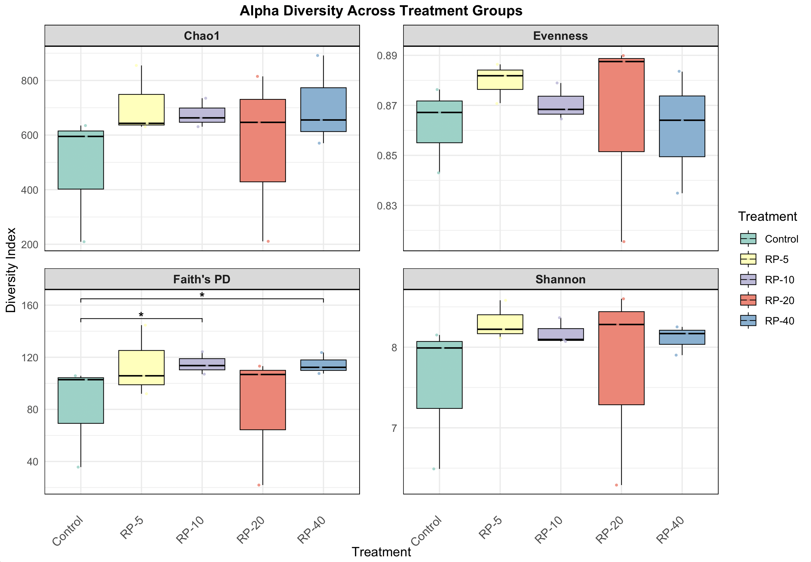

# 4. Visualization of Gut Microbiome Analysis Results

## 4.1. Genus Composition Analysis

### 4.1.1. Environment Setup and Data Loading

#### R Library Installation
```r
install.packages(c("tidyverse", "RColorBrewer"))
```
```r
library(tidyverse)
library(RColorBrewer)
```

#### Data Import
Import the necessary data files:
```r
feature_table <- read_tsv("feature-table.tsv")
taxonomy <- read_tsv("taxonomy.tsv")
metadata <- read_tsv("metadata.tsv")
```

### 4.1.2. Data Processing and Preparation

#### Wide to Long Format Conversion
```r
feature_long <- feature_table %>%
  pivot_longer(cols = -`OTU ID`, names_to = "sample-id", values_to = "Abundance") %>%
  mutate(`sample-id` = as.numeric(`sample-id`))
```

#### Data Merging with Taxonomy and Metadata
```r
merged_data <- feature_long %>%
  left_join(taxonomy, by = c("OTU ID" = "Feature ID")) %>%
  left_join(metadata, by = "sample-id")
```

#### Relative Abundance Normalization
```r
final_data <- merged_data %>%
  group_by(`sample-id`) %>%
  mutate(Relative_Abundance = Abundance / sum(Abundance)) %>%
  ungroup()
```

#### Genus Column Processing
```r
final_data <- final_data %>%
  mutate(Genus = str_extract(Taxon, "g__[^;]+")) %>% 
  mutate(Genus = ifelse(is.na(Genus), "uncultured unclassified", Genus)) %>%
  mutate(Genus = str_remove(Genus, "^g__"),
         Genus = str_replace_all(Genus, "_", " "),
         Genus = ifelse(str_detect(Taxon, "uncultured|unclassified"), "uncultured unclassified", Genus))
```

#### Selection of Top 30 Predominant Genera
```r
top_30_genus <- final_data %>%
  group_by(Genus) %>%
  summarise(Total_Abundance = sum(Relative_Abundance)) %>%
  arrange(desc(Total_Abundance)) %>%
  slice_head(n = 30) %>%
  pull(Genus)

final_data <- final_data %>%
  mutate(Genus = ifelse(Genus %in% top_30_genus, Genus, "Other"))
```

#### Genus and Treatment Order Arrangement
```r
final_data$Genus <- factor(final_data$Genus, levels = sort(unique(final_data$Genus)))
final_data$Treatment <- factor(final_data$Treatment, levels = c("Control", "RP-5", "RP-10", "RP-20", "RP-40"))
```

#### Sample Renaming
```r
final_data <- final_data %>%
  mutate(Sample_Label = sprintf("CH128-001M%04d", `sample-id`))
```

### 4.1.3. Color Customization
```r
highlight_colors <- c(
  "uncultured unclassified" = "steelblue",
  "Staphylococcus" = "skyblue",
  "Chloroplast" = "red",
  "Muribaculaceae" = "purple",
  "Alloprevotella" = "green"
)

remaining_genus <- setdiff(unique(final_data$Genus), names(highlight_colors))
num_colors_needed <- length(remaining_genus)

if (num_colors_needed > 0) {
  default_colors <- setNames(
    colorRampPalette(brewer.pal(min(9, num_colors_needed), "Set1"))(num_colors_needed),
    remaining_genus
  )
} else {
  default_colors <- c()
}

genus_colors <- c(highlight_colors, default_colors)
```

### 4.1.4. Stacked Bar Plot
```r
ggplot(final_data, aes(x = Sample_Label, y = Relative_Abundance, fill = Genus)) +
  geom_bar(stat = "identity", position = "stack", width = 0.65) +
  facet_grid(~Treatment, scales = "free_x", space = "free_x") +
  scale_fill_manual(values = genus_colors) +
  labs(
    title = "Composition of Gut Microbiota at the Genus Level",
    x = "Sample", y = "Relative Abundance", fill = "Genus") +
  theme_minimal() +
  theme(
    plot.title = element_text(face = "bold", size = 14, hjust = 0.5),
    axis.text.x = element_text(angle = 90, vjust = 0.5, hjust = 1, size = 7),
    legend.text = element_text(size = 8),
    panel.border = element_rect(color = "black", fill = NA, size = 0.4),
    strip.background = element_rect(fill = "grey90", color = "black"),
    strip.text = element_text(face = "bold", size = 9)
  )
```

**Visualization:**


*Download:* [Composition barplot](<Composition_barplot.png>)

## 4.2. Alpha Diversity Analysis

### 4.2.1. Environment Setup and Data Loading

```r
library(ggplot2)
library(ggpubr)
library(dplyr)
library(reshape2)
library(RColorBrewer)

shannon <- read.table("R_steps/alpha-diversity-shannon.tsv", header = TRUE, sep = "\t", row.names = 1)
chao1 <- read.table("R_steps/alpha-diversity-chao1.tsv", header = TRUE, sep = "\t", row.names = 1)
evenness <- read.table("R_steps/alpha-diversity-evenness.tsv", header = TRUE, sep = "\t", row.names = 1)
faithpd <- read.table("R_steps/alpha-diversity-faith_pd.tsv", header = TRUE, sep = "\t", row.names = 1)

rownames(chao1) <- rownames(shannon)
rownames(evenness) <- rownames(shannon)
rownames(faithpd) <- rownames(shannon)

alpha_div <- data.frame(
  SampleID = rownames(shannon),
  Shannon = shannon$shannon_entropy,
  Chao1 = chao1$chao1,
  Evenness = evenness$pielou_evenness,
  Faithpd = faithpd$faith_pd
)

metadata <- read.table("Qiime_steps/metadata.tsv", header = TRUE, sep = "\t", row.names = 1)
metadata$SampleID <- rownames(metadata)
alpha_div <- merge(alpha_div, metadata, by = "SampleID")
```

### 4.2.2. Data Processing and Preparation

```r
alpha_long <- melt(alpha_div, id.vars = c("SampleID", "Treatment"),
                   measure.vars = c("Shannon", "Chao1", "Evenness", "Faithpd"))


desired_order <- c("Control", "RP-5", "RP-10", "RP-20", "RP-40")
alpha_long$Treatment <- factor(alpha_long$Treatment, levels = desired_order)

color_palette <- RColorBrewer::brewer.pal(n = length(desired_order), name = "Set3")
```

### 4.2.3. Statistical Analysis and Annotation

```r
sig_faith <- read.csv("R_steps/kruskal-wallis-pairwise-Treatment.csv", header = TRUE)
names(sig_faith) <- tolower(names(sig_faith))
sig_faith <- sig_faith %>% rename(group1 = group.1, group2 = group.2)
sig_faith <- sig_faith %>% filter(p.value < 0.05)
sig_faith$label <- "*"
sig_faith$variable <- "Faithpd"

sig_faith$group1 <- gsub("\\s*\\(n=\\d+\\)", "", sig_faith$group1)
sig_faith$group2 <- gsub("\\s*\\(n=\\d+\\)", "", sig_faith$group2)

sig_faith$group1 <- factor(sig_faith$group1, levels = desired_order)
sig_faith$group2 <- factor(sig_faith$group2, levels = desired_order)

y_max <- max(alpha_long$value[alpha_long$variable == "Faithpd"], na.rm = TRUE)
step_increase <- 0.05 * (y_max - min(alpha_long$value, na.rm = TRUE))

sig_faith$y.position <- y_max + seq(0.05, step_increase * nrow(sig_faith), by = step_increase)

sig_faith <- sig_faith %>% 
  mutate(y.position = ifelse(group1 == "Control" & group2 == "RP-10", y.position + 5, y.position))

print(sig_faith)
```

### 4.2.4. Visualization

```r
alpha_plot <- ggplot(alpha_long, aes(x = Treatment, y = value, fill = Treatment)) +
  geom_boxplot(outlier.shape = NA, color = "black", size = 0.3) +
  geom_jitter(aes(color = Treatment), width = 0.1, size = 0.5, alpha = 0.8) +
  stat_pvalue_manual(sig_faith,
                     label = "label",
                     tip.length = 0.02,
                     hide.ns = TRUE,
                     step.increase = 0.1,
                     fontface = "bold",
                     inherit.aes = FALSE) +
  facet_wrap(~variable, scales = "free_y",
             labeller = labeller(variable = c("Faithpd" = "Faith's PD",
                                              "Shannon" = "Shannon",
                                              "Chao1" = "Chao1",
                                              "Evenness" = "Evenness"))) +
  theme_minimal() +
  labs(x = "Treatment", y = "Diversity Index", 
       title = "Alpha Diversity Across Treatment Groups") +
  scale_fill_manual(values = color_palette) +
  scale_color_manual(values = color_palette) +
  theme(
    plot.title = element_text(face = "bold", size = 14, hjust = 0.5),
    strip.background = element_rect(fill = "gray85", color = "black", size = 0.5),
    strip.text = element_text(size = 10, face = "bold"),
    panel.border = element_rect(color = "black", fill = NA, size = 0.5),
    panel.spacing = unit(1, "lines"),
    axis.text.x = element_text(angle = 45, hjust = 1, vjust = 0.5, size = 10),
    axis.title.x = element_text(margin = margin(t = 10)),
    strip.placement = "outside"
  )

print(alpha_plot)
```

**Visualization:**



*Download:* [Alpha Diversity Across Treatment Groups](<Alpha_Diversity.png>)